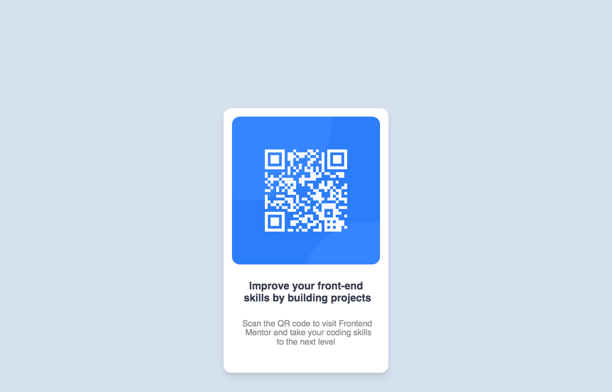

# Frontend Mentor - QR code component solution

This is a solution to the [QR code component challenge on Frontend Mentor](https://www.frontendmentor.io/challenges/qr-code-component-iux_sIO_H). Frontend Mentor challenges help you improve your coding skills by building realistic projects. 

## Table of contents

- [Overview](#overview)
  - [Screenshot](#screenshot)
  - [Links](#links)
- [My process](#my-process)
  - [Built with](#built-with)
  - [What I learned](#what-i-learned)
  - [Continued development](#continued-development)
  - [Useful resources](#useful-resources)
- [Author](#author)
- [Acknowledgments](#acknowledgments)


## Overview
This is my solution for Frontend Mentor challenge

QR code component challenge

### Screenshot




## There is four components to this project;
   First is the background 
   Second the container
   Third is the img and the text {heading and paragraph}
   Finaly the styling using css

### Links

- My Solution URL:(https://github.com/mohamedballa/my-Solution-QR-components)
- Live Site URL:(https://mohamedballa.github.io/my-Solution-QR-components/)

## My process
I first built the structure of the page using HTML, which include the three part mention above , then styled using css.


### Built with

- Semantic HTML5 markup
- CSS 

### What I learned

I have some knowledge about HTML/CSS but still beginner.
The biggest hurdle in the progect was :
how to align the elements with each other?

used css
```css
    .container {margin: 0 auto;}    for centring the container 
    img {display: block}            for the img
```
how to positions elements inside the container?

for the img using
```css
  img {padding: 1rem}
```
I had hard time with the margin of the text

The biggest problem how preserve the the elements when changing the browser window size.
i found in youtube a solution "container queries"
in order to make the text[h,p] fixed during different size of the window
```css
.h-conatiner{
  container-type: inline-size;
}
 p{
  font-size: clamp(1rem,2.8cqi,1rem);  
}

```
the clamp function control the font size during different size from min to maz.
also build css variables and applyed them.


### Continued development

Thing to focus on:
1\ Elements alignment
2\ Text size control in different window size.


- Resource that helped me:
I highly recomment Kevin powell channel in youtube 
the channel foucus on  HTML/CSS primarily 


## Author

- Frontend Mentor - [@mohamedballa](https://www.frontendmentor.io/profile/mohamedballa)
- Twitter - [@mhballa1](https://www.twitter.com/mhballa1)


## Acknowledgments

Again I give credit to Kevin powell at youtube , highly recommend.


